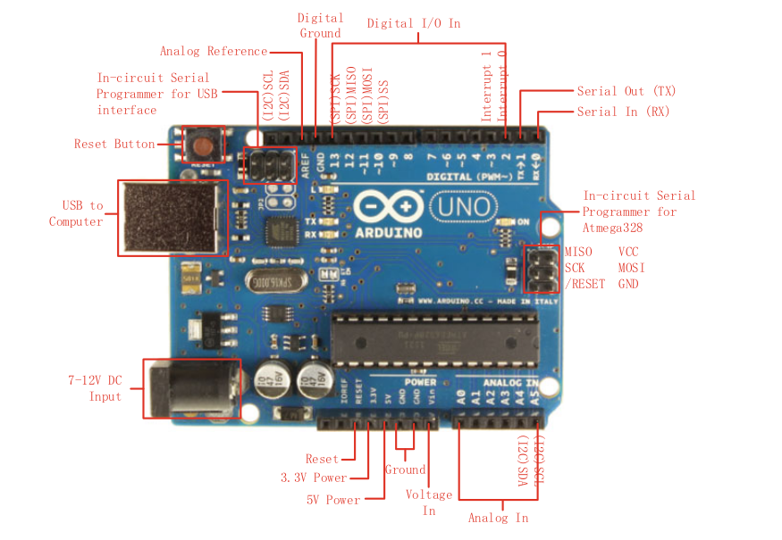

## 1. INTRODUCCIÓN A ARDUINO

### 1.1 ORIGEN
El origen de arduino data del año 2005 en Italia (Instituto de Diseño Interactivo de Ivrea). En la actualidad es el proyecto de hardware y software libre de mayor importancia a nivel mundial.
Las principales ventajas son:
* Extensa y activa comunidad de usuarios
* Entorno de programación multiplataforma: Windows, Mac y Linux
* Placas economicas
* Placas reutilizables y versatiles

### 1.2 VARIANTES

#### Familia clásica
Son la columna vertebral del proyecto ARDUINO y esta compuesto por las siguientes placas (actualizado a septiembre 2024):

* Arduino UNO R3 (ATmega328p - 8 bits)
* Arduino UNO R4 (Renesas RA4M1 - 32 bits)
* Arduino Leonardo (ATmega32u4 - 8 bit)
* Arduino Micro (ATmega32u4 - 8 bit)
* Arduino Zero (ATSAMD21G18 - 32 bit)

#### Familia MEGA
Son placas para proyectos que exigen más potencia de computo y mas GPIO

* Arduino Mega 2560 (ATmega2560 - 8 bits)
* Arduino Due (ATmega SAM3X8E - 32 bits - primer Arduino de 32 bits)
* Arduino GIga (STM32H747XI - 32 bits dual core

#### Familia MKR
Es una serie de placas con el fin de no necesitar circuiteria adicional
Todos estann basados en el micro ARM SAMD21 de 32 bits

#### Familia Nano
Son placas que ocupan poco espacio. Tienen un monton de sensores integrados. Pueden programarse con micro python y soportan machine learning

* Arduino Nano IoT (ARM SAMD21 - 32 bits)
* Arduino Nano RP 2040 (RP2040 - 32 bits dual core)
* Arduino Nano ESP 32 ( Xtensa® LX7 Microprocessor) - 32 bits dual core)
* Arduino Nano 33 BLE Sense ( 64 MHz Arm® Cortex®-M4F (with FPU) - 32 bits)
* Arduino Nano 33 BLE ( nRF52840 - 32 bits)
* Arduino Nano Every (ATMega 4809 - 8 bits)
* Arduino Nano (ATMega 328 - 8 bits)

### 1.3 ARDUINO R3

La placa Arduino R3 esta basada en el microcontrolador ATmega328. Tiene 14 pines de entrada/salida digitales (de los cuales 6 se pueden usar como salidas PWM), 6 entradas analógicas, un cristal de 16 MHz, conexión USB, un conector de alimentación, un conector ICSP y un boton de reset.
Especificaciones:
* Microcontrolador: ATmega328
* Tensión de operación: 5V
* Rango de tensión de alimentación de entrada (recomendada) : 7-12 V
* Rango de tensión de entrada (limite) : 6-20 V
* Pines digitales de I/O: 14 (6 pueden ser PWM)
* Pines analógicos de entrada: 6
* Corriente continua por PIN de I/O: 40 mA
* Corriente continua para el pin de 3.3 V : 50 mA
* Memoria Flash: 32 kB (de los cuales 0.5 kB usa el bootloader)
* SRAM: 2kB
* EEPROM: 1 kB
* Velocidad de reloj: 16 MHz

* **Tx** y **Rx** son los pines serie UART usados para la comunicación RS-232 y USB
* **I2C** es un protocolo de comuncación serie que usa un pin de datos bidireccional (SDA) y un pin de clock (SCL)
* **SPI** es otro protocolo de comunicación serie que utiliza un pin para trasmitir (MOSI - Master Out Slave In), otro para recibir (MISO) y un tercero para el clock (SCK)
* **PWM** (Pulse Width Modulator) es usado para crear una onda cuadrada con un ciclo de trabajo específico.
* **ICSP** (In Circuit Serial Programming) es otra forma de programar el microcontrolador

### 1.4 Instalación del entorno de desarrollo (IDE)

Para comenzar a trabajar con las placas Arduino, lo primero es descargar e instalar el entorno de desarrollo (IDE) desde la siguiente dirección: 

  
